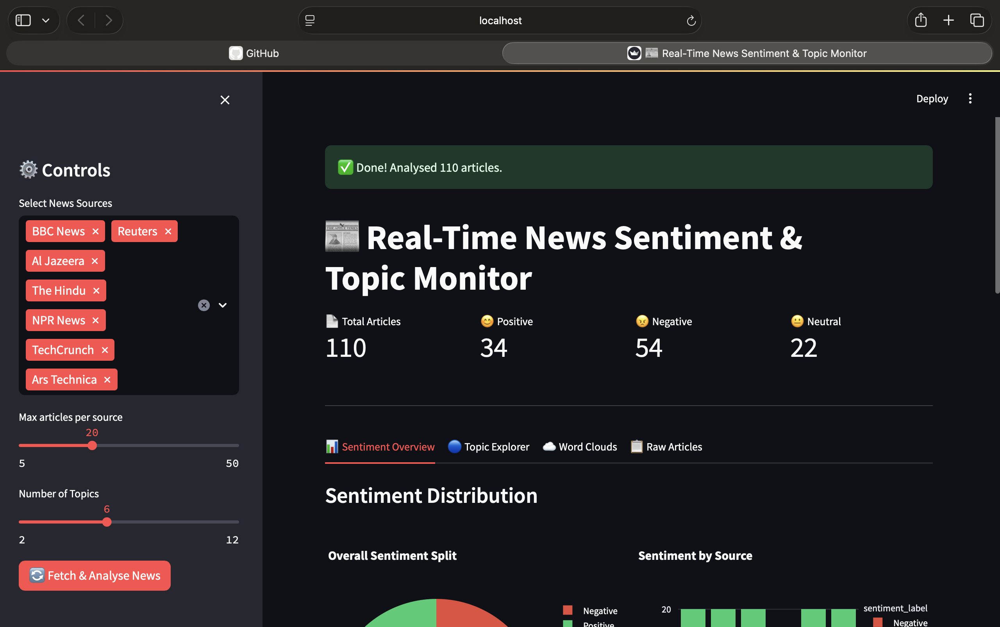
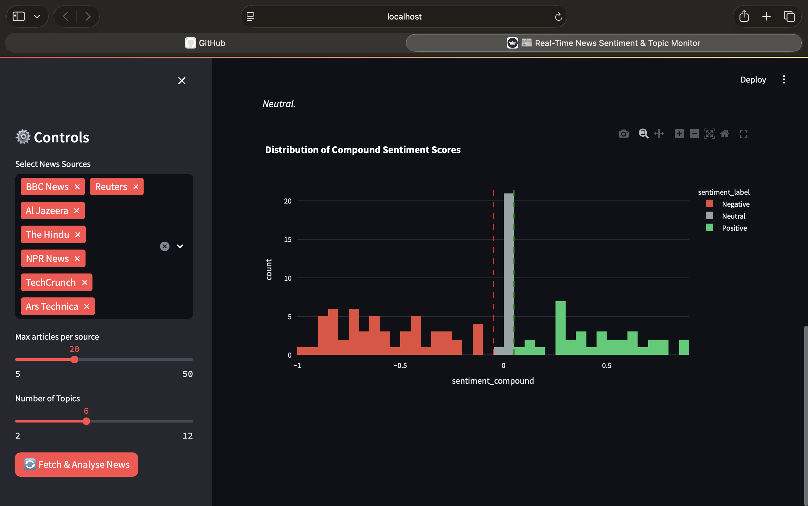

# 📰 Real-Time News Sentiment & Topic Monitor

A beginner-friendly Machine Learning project that:
- **Fetches live news** from BBC, Reuters, Al Jazeera, The Hindu & more
- **Analyses sentiment** (Positive / Negative / Neutral) using VADER
- **Discovers topics** automatically using LDA (a classic NLP algorithm)
- **Shows everything** in an interactive Streamlit dashboard


## 📁 Project Structure

```
Real_time_news_sentiment_and_topic_monitor/
│
├── app.py                  ← Streamlit dashboard (run this!)
├── requirements.txt        ← Python package list
├── README.md               ← This file
│
├── src/                    ← Core ML code
│   ├── data_ingestion.py   ← Fetches news from RSS feeds
│   ├── preprocessing.py    ← Cleans raw text
│   ├── sentiment_model.py  ← VADER sentiment scoring
│   ├── topic_model.py      ← LDA unsupervised topic clustering
│   └── utils.py            ← Shared helper functions
│
├── scripts/
│   └── run_pipeline.py     ← Run everything from terminal (no UI)
│
├── data/
│   ├── raw/                ← Downloaded articles (before cleaning)
│   └── processed/          ← Cleaned & analysed articles (CSV)
│
└── notebooks/              ← Jupyter notebooks for experiments
```

---

## 🧠 ML Concepts Used

| Module | Concept | Type |
|---|---|---|
| `data_ingestion.py` | RSS Parsing | Data Engineering |
| `preprocessing.py` | Tokenization, Lemmatization, Stopword removal | NLP |
| `sentiment_model.py` | VADER Sentiment Analysis | Rule-based NLP |
| `topic_model.py` | LDA (Latent Dirichlet Allocation) | Unsupervised ML |

---

## 🧪 Test Individual Modules

```bash
# Test data ingestion
python -m src.data_ingestion

# Test preprocessing
python -m src.preprocessing

# Test sentiment
python -m src.sentiment_model

# Test topic model
python -m src.topic_model

# Run full pipeline (no UI)
python scripts/run_pipeline.py
```

---

## 📊 Dashboard Features

- **KPI Cards** – total articles, positive/negative/neutral count
- **Sentiment Pie Chart** – overall split
- **Sentiment by Source** – stacked bar chart
- **Compound Score Histogram** – distribution of emotion scores
- **Topic Explorer** – LDA topics with sample headlines
- **Topic × Sentiment Heatmap** – cross-analysis
- **Word Clouds** – by Positive, Neutral, Negative
- **Filterable Table** – download as CSV

## 📸 Demo

### Dashboard Overview


### Topic Explorer


### Sentiment Analysis


## 🚀 How to Run

```bash
git clone <your-repo-url>
cd Real_time_news_sentiment_and_topic_monitor

python3 -m venv venv
source venv/bin/activate

pip install -r requirements.txt

PYTHONPATH=. streamlit run src/app.py