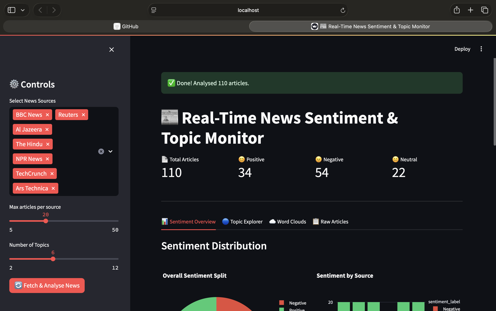
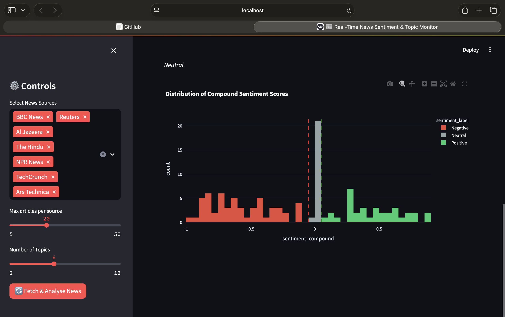
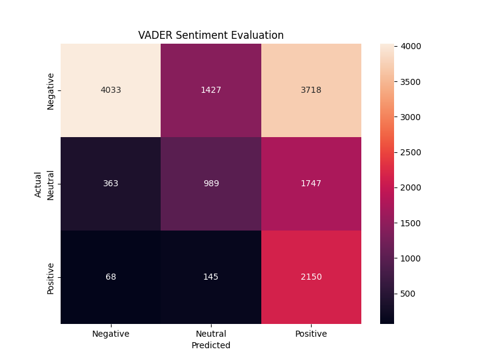

#  Real-Time News Sentiment & Topic Monitor

A beginner-friendly Machine Learning project that:
- **Fetches live news** from BBC, Reuters, Al Jazeera, The Hindu & more
- **Analyses sentiment** (Positive / Negative / Neutral) using VADER
- **Discovers topics** automatically using LDA (a classic NLP algorithm)
- **Shows everything** in an interactive Streamlit dashboard


##  Project Goal

This project demonstrates an end-to-end NLP pipeline that:
- Collects live news articles from RSS feeds
- Cleans and preprocesses text data
- Performs sentiment analysis using VADER
- Discovers latent topics using LDA
- Visualizes insights through an interactive Streamlit dashboard
## Project Structure

```
Real_time_news_sentiment_and_topic_monitor/
│
├── requirements.txt        ← Python dependencies
├── README.md               ← Project documentation
│
├── src/                    ← Core ML + App code
│   ├── app.py              ← Streamlit dashboard (run this!)
│   ├── run_pipeline.py     ← Run full pipeline (no UI)
│   ├── data_ingestion.py   ← Fetches news from RSS feeds
│   ├── preprocessing.py    ← Cleans raw text
│   ├── sentiment_model.py  ← VADER sentiment analysis
│   ├── topic_model.py      ← LDA topic modeling
│   └── utils.py            ← Helper functions
│
├── data/
│   ├── raw/                ← Raw downloaded articles
│   └── processed/          ← Cleaned & analyzed data
│
├── notebooks/              ← Jupyter notebooks (experiments)
├── scripts/                ← (optional / unused)
└── images/                 ← Screenshots for README
```

##  ML Concepts Used

| Module | Concept | Type |
|---|---|---|
| `data_ingestion.py` | RSS Parsing | Data Engineering |
| `preprocessing.py` | Tokenization, Lemmatization, Stopword removal | NLP |
| `sentiment_model.py` | VADER Sentiment Analysis | Rule-based NLP |
| `topic_model.py` | LDA (Latent Dirichlet Allocation) | Unsupervised ML |

---

##  Test Individual Modules

```bash
# Test data ingestion
python -m src.data_ingestion

# Test preprocessing
python -m src.preprocessing

# Test sentiment
python -m src.sentiment_model

# Test topic model
python -m src.topic_model

# Run full pipeline (no UI)
python scripts/run_pipeline.py
```

---

## 📊 Dashboard Features

- **KPI Cards** – total articles, positive/negative/neutral count
- **Sentiment Pie Chart** – overall split
- **Sentiment by Source** – stacked bar chart
- **Compound Score Histogram** – distribution of emotion scores
- **Topic Explorer** – LDA topics with sample headlines
- **Topic × Sentiment Heatmap** – cross-analysis
- **Word Clouds** – by Positive, Neutral, Negative
- **Filterable Table** – download as CSV

## Demo

### Dashboard Overview


### Topic Explorer


### Sentiment Analysis


## Model Evaluation

### Evaluation Dataset
- Twitter Airline Sentiment Dataset
- 14,640 labeled tweets

### Results

| Metric | Score |
|----------|----------|
| Accuracy | 48.99% |
| Weighted F1 Score | 0.51 |

### Classification Report

| Class | Precision | Recall | F1 |
|---------|---------|---------|---------|
| Negative | 0.90 | 0.44 | 0.59 |
| Neutral | 0.39 | 0.32 | 0.35 |
| Positive | 0.28 | 0.91 | 0.43 |

### Confusion Matrix



### Key Insight

VADER performs reasonably well for general sentiment analysis but struggles with domain-specific airline tweets. This evaluation highlights the limitations of rule-based sentiment analysis and motivates future work using supervised machine learning models.

##  How to Run

```bash
git clone <your-repo-url>
cd Real_time_news_sentiment_and_topic_monitor

python3 -m venv venv
source venv/bin/activate

pip install -r requirements.txt

PYTHONPATH=. streamlit run src/app.py
```